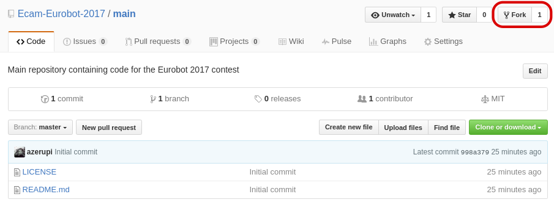
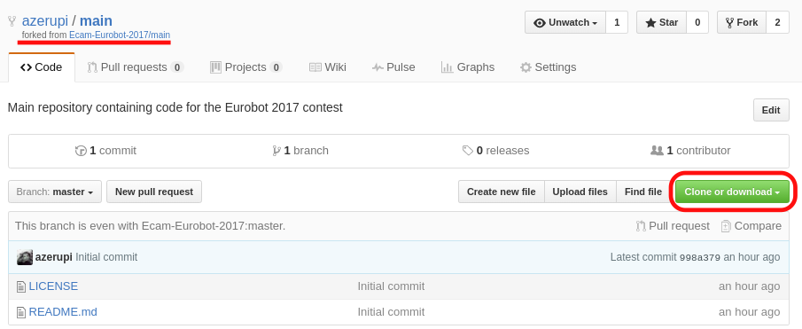
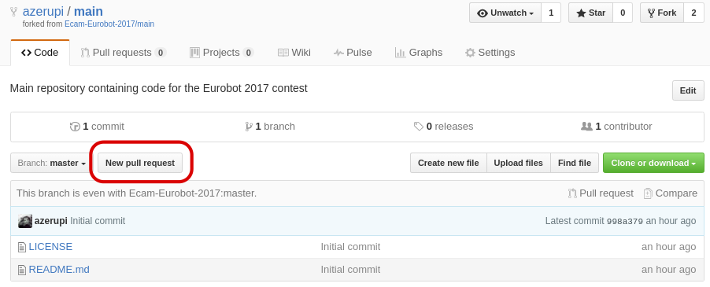

# Contributing to EuroBot 2018

:+1::tada: First off, thanks for taking the time to contribute! :tada::+1:

The following is a set of guidelines for contributing to EuroBot and its packages, which are hosted in the [Ecam-Eurobot Organization](https://github.com/Ecam-Eurobot) on GitHub. These are mostly guidelines, not rules. Use your best judgment, and feel free to propose changes to this document in a pull request.

#### Table Of Contents

[How Can I Contribute?](#how-can-i-contribute)
  * [Your First Code Contribution](#your-first-code-contribution)

[Styleguides](#styleguides)
  * [Git Commit Messages](#git-commit-messages)
  * [Python Styleguide](#python-styleguide)
  * [C++ Styleguide](#c++-styleguide)
  * [Documentation Styleguide](#documentation-styleguide)


  ## How Can I Contribute?

  ### Your First Code Contribution
  To ensure some quality control and cohesion in the code, each contribution must be reviewed and approved by a member of the **reviewers** team. No one has the rights to make commits directly on the master branch. This is why everyone must create a personal copy of the repo *(= a fork)* on which they can make commits. Once the change is ready to be embedded in the original code, simply create a **Pull-Request** so that the change can be reviewed and integrated.

  The steps to follow are as follows:
  1. Create a **fork** of the repository.
  

  2. You will have a copy of the repository under your personal namespace that you will be able to clone. Make sure the repository you are looking at is the fork under your name and not the original. Then press the **Clone or download** button in green. Copy the link that appears.
  

  3. Open the terminal and type the following command, replacing `<link>` with the link you just copied:
  ```
  git clone <link>
  ```
  4. The repository should be cloned on your computer. You can make your changes. Once finished, you must commit changes. It is advisable to always work on another branch and not directly on the master branch.
  ```
  git checkout -b <branch-name> #Create and swap to the branch with name: <branch-name>
  git add .
  git commit -m "First commit"
  git push origin <branch-name>
  ```

  5. Once the changes are on your fork on GitHub, you can do a **Pull-Request**
    

  ## Styleguides

  ### Git Commit Messages

  * Use the present tense ("Add feature" not "Added feature")
  * Reference issues and pull requests liberally after the first line
  * When only changing documentation, include `[doc]` in the commit description

  ### Python Styleguide

  All Python must adhere to [Python PEP8 Standard Style](https://www.python.org/dev/peps/pep-0008/).

  ### C++ Styleguide

  All C++ must adhere to [Google C++ Standard Style](http://google.github.io/styleguide/cppguide.html).

  ### Documentation Styleguide

  Follow the documentation styleguide of the programming language used.
